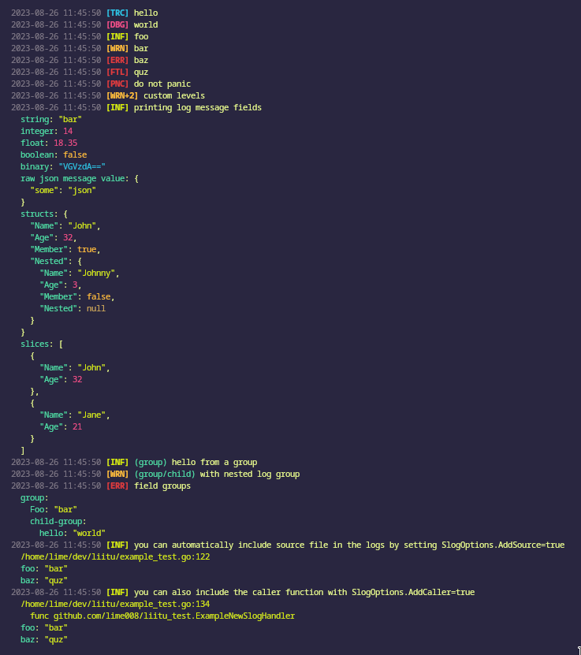

# liitu

liitu is a pretty logging library for go with focus on readability. It currently implements formatters for `github.com/rs/zerolog` and `log/slog`.

### liitu == crayon

From a old finnish proverb:

> "Ne piirtää kel on liituu" \
> Translation: "Those who have cryons/chalk will draw"



## Getting started

`go get -u github.com/lime008/liitu`

### Using with slog

```go
package main

import (
	"os"

	"github.com/lime008/liitu"
	"log/slog"
)

func main() {
	logger = slog.New(liitu.NewSlogHandler(os.Stderr, nil))
	log.Debug().Msg("hi")
	log.Debug().Msg("hello")
}

```

### Using with zerolog

```go
package main

import (
	"os"

	"github.com/lime008/liitu"
	"github.com/rs/zerolog/log"
)

func main() {
	log.Logger = log.Output(liitu.ZerologWriter{Out: os.Stderr})
	log.Debug().Msg("hi")
	log.Debug().Msg("hello")
}

```

### References

- zerolog implementation is originally from [github.com/UnnoTed/horizontal](https://github.com/UnnoTed/horizontal)
- slog implementation referenced from [https://github.com/lmittmann/tint](https://github.com/lmittmann/tint)
